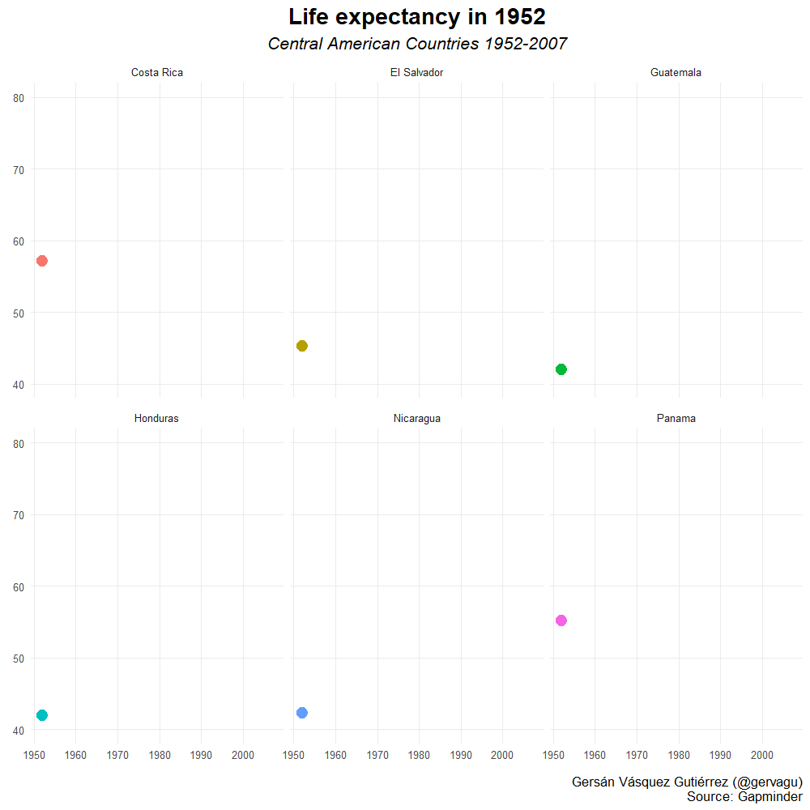
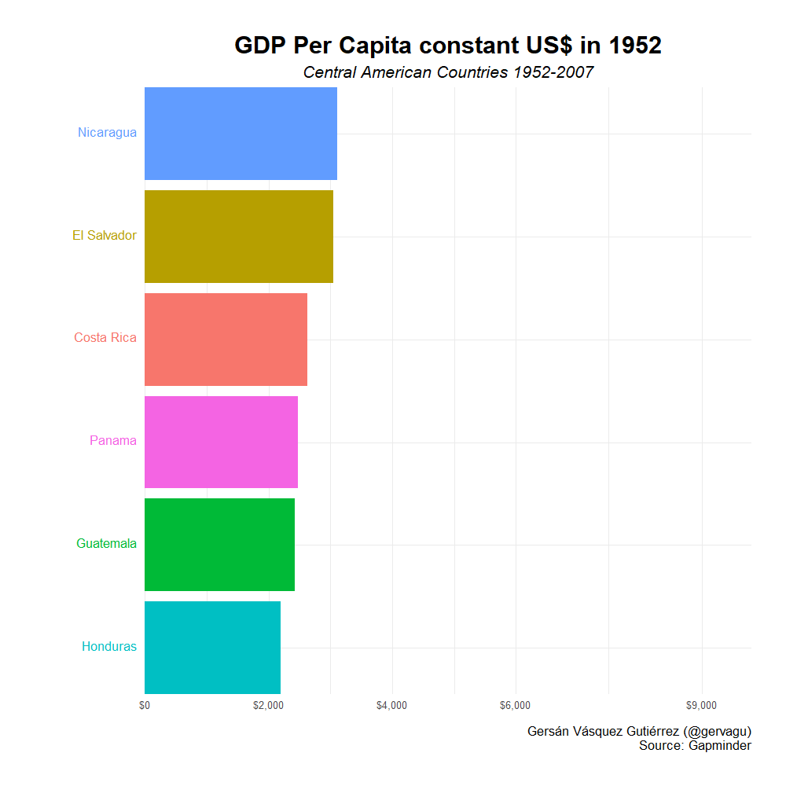

# Overview

Creating animated charts in R using life expectancy and GDP per capita data and plotting them using `Tidyverse` and `gganimate` packages.

## Evolution of GDP Per Capita in Central America since 1950

## Racing Chart of GDP Per Capita evolution in Central America since 1950

## Data

The data comes from the `gapminder` package. 
